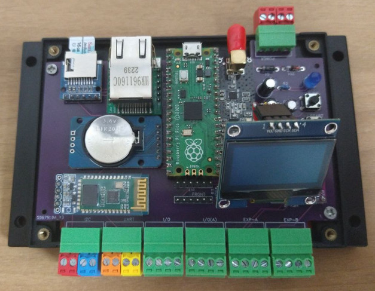

# PicoBox

## About
PicoBox - Cheap and simple programmable unit for any practical and experimental purposes powered by Raspberry Pi Pico
with Ethernet, Radio, RTC and Bluetooth module

## Overview
- Designed for industrial DIN rail
- 1.3" Status OLED display
- Micro SD Card interface
- 15 I/O ports headers
- One UART and one I2C bus headers
- One configurable I2C/UART bus header
- Functional button
- Noise beeper
- Ethernet with RJ45
- RTC with backup 3V battery
- Radio 2.4GHz IMS Band with antenna SMA
- Bluetooth

## Project includes
- Schematics & PCB project in EasyEDA
- Software boilerplate with drivers 
- Operating system based on FreeRTOS (comming soon)
- 3D Printed cover project (comming soon)

## Modules
- Raspberry Pi Pico RP2040 (MCU)
- W5500 Lite - WizNet Ethernet (MET)
- DS3231 RTC Clock with EEPROM (MRT)
- PCF8574 Digital I/O Expander (MEX)
- RF24L01 Radio - IMS Band (MRA)
- SD Card holder + SD Card (MSD)
- HC06 Slave Bluetooth (optional) (MBT)
- 1.3" OLED I2C Display (MDI)

## Other parts
- Resistor 1KOhm/0.25W (2 pcs)
- Capacitor 47uF/16V
- Capacitor 470uF/10V
- Capacitor 220uF/10V
- Piezo-Buzzer BMT
- Transistor BC547
- Diode 1N4007 (2 pcs)
- Diode 5V1
- LED 5mm Blue or Red (optional)
- Traditional Micro-switch (optional) (2 pcs)
- Pitch 3.5mm + Male (7 pcs)
- Battery 3V LIR2032
- DIN project box Vange VG-P05+ (bottom part used only)
