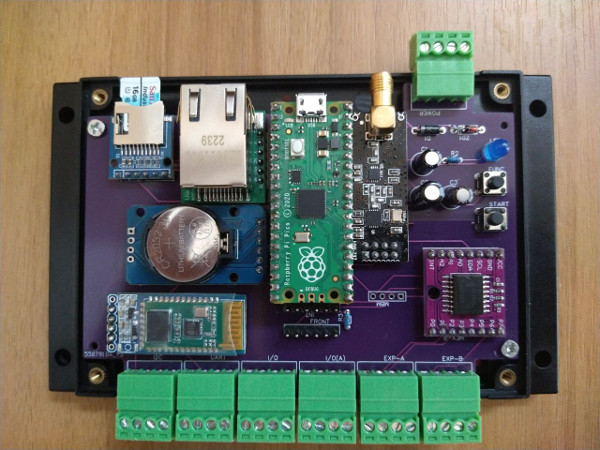

# PicoBox

## About
PicoBox - Simple programmable unit for any practical and experimental purposes powered by Raspberry Pi Pico

- Schematics & PCB project in EasyEDA
- PCB and project box designed for DIN rail
- Bluetooth
- IMS Radio + Ext. SMA
- Ehternet
- RTC
- SD Card
- Two UART and one I2C bus headers
- 15 I/O ports

## Used modules
- RPI Pico RP2040 (MCU)
- W5500 Lite - WizNet Ethernet (MET)
- DS3231 RTC Clock (MRT)
- PCF8574 Digital I/O Expander (MEX)
- RF24L01 Radio (MRA)
- SD Card holder + SD Card (MSD)
- HC06 Slave Bluetooth (optional) (MBT)
- BME280 Sensor (optional) (MBM)

#### Other parts
- Resistor 1KOhm/0.25W (2 pcs)
- Capacitor 47uF/16V
- Capacitor 470uF/10V
- Capacitor 220uF/10V
- Piezo-Buzzer BMT
- Transistor BC547
- Diode 1N4007 (2 pcs)
- Diode 5V1
- LED 5mm Blue or Red (optional)
- Traditional Micro-switch (optional) (2 pcs)
- Pitch 3.5mm + Male (7 pcs)
- Battery LIR2032
- DIN project box Vange VG-P05+
